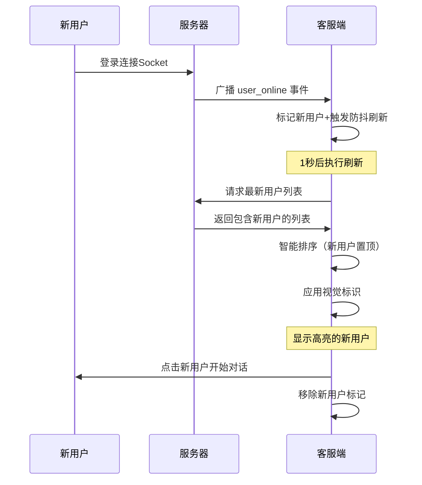

# 实时用户列表更新功能实现

## 🎯 问题描述
客服的聊天列表无法实时显示新注册用户，需要手动刷新才能看到新用户，影响客服工作效率。同时新用户在列表中不够突出，客服难以快速识别。

## ✅ 解决方案

### 1. 服务器端实时通知机制 (`server.js`)

#### 新增广播功能
```javascript
// 广播消息给所有在线客服的辅助函数
function broadcastToCustomerServices(event, data) {
  console.log(`📢 广播给客服: ${event}`, data);
  connectedCustomerServices.forEach((csSocket, csId) => {
    try {
      csSocket.emit(event, data);
    } catch (error) {
      console.error(`广播给客服 ${csId} 失败:`, error);
    }
  });
}

// 广播消息给所有在线用户的辅助函数
function broadcastToUsers(event, data) {
  console.log(`📢 广播给用户: ${event}`, data);
  connectedUsers.forEach((userSocket, userId) => {
    try {
      userSocket.emit(event, data);
    } catch (error) {
      console.error(`广播给用户 ${userId} 失败:`, error);
    }
  });
}
```

#### 用户上线/下线通知
```javascript
// 用户连接时 - 通知所有客服
if (socket.user.role === 'customer_service') {
  // 客服上线通知
  broadcastToUsers('customer_service_online', {
    customerServiceId: socket.user.id,
    timestamp: new Date()
  });
} else {
  // 用户上线通知
  broadcastToCustomerServices('user_online', {
    userId: socket.user.id,
    timestamp: new Date()
  });
}

// 用户断开连接时 - 通知相关方
if (socket.user.role === 'customer_service') {
  broadcastToUsers('customer_service_offline', {
    customerServiceId: socket.user.id,
    timestamp: new Date()
  });
} else {
  broadcastToCustomerServices('user_offline', {
    userId: socket.user.id,
    timestamp: new Date()
  });
}
```

### 2. 客服端实时监听与智能排序 (`MessageScreen.tsx`)

#### 导入必要依赖
```typescript
import React, { useState, useEffect, useContext, useCallback, useRef } from 'react';
const { subscribeToMessages, unreadMessageCount, socket } = useSocket();
const refreshTimeoutRef = useRef<NodeJS.Timeout | null>(null);
```

#### 防抖刷新机制
```typescript
// 防抖刷新函数 - 避免频繁的网络请求
const debouncedRefresh = useCallback(() => {
  // 清除之前的定时器
  if (refreshTimeoutRef.current) {
    clearTimeout(refreshTimeoutRef.current);
  }
  
  // 设置新的定时器
  refreshTimeoutRef.current = setTimeout(() => {
    console.log('🔄 [MessageScreen] 防抖刷新联系人列表');
    fetchContacts();
  }, 1000); // 1秒防抖延迟
}, [fetchContacts]);
```

#### 扩展用户数据接口
```typescript
interface User {
  _id: string;
  phoneNumber: string;
  name?: string;
  avatar?: string;
  lastMessage?: string;
  lastMessageTime?: string;
  unreadCount?: number;
  conversationId?: string;
  lastMessageTimestamp?: Date;
  isNewOnline?: boolean; // 新增：标记是否为新上线用户
  onlineTimestamp?: Date; // 新增：用户上线时间戳
}
```

#### 新用户管理状态
```typescript
const [newOnlineUsers, setNewOnlineUsers] = useState<Set<string>>(new Set());
```

#### 智能排序逻辑
```typescript
// 智能排序：新用户 > 未读消息 > 最近消息 > 其他
const sortedContacts = contactsWithNewStatus.sort((a, b) => {
  // 第1优先级：新上线用户排在最前面
  if (a.isNewOnline && !b.isNewOnline) return -1;
  if (!a.isNewOnline && b.isNewOnline) return 1;
  
  // 如果都是新用户，按上线时间排序（最新的在前）
  if (a.isNewOnline && b.isNewOnline) {
    if (a.onlineTimestamp && b.onlineTimestamp) {
      return b.onlineTimestamp.getTime() - a.onlineTimestamp.getTime();
    }
  }
  
  // 第2优先级：有未读消息的排在前面
  if (a.unreadCount && !b.unreadCount) return -1;
  if (!a.unreadCount && b.unreadCount) return 1;
  
  // 第3优先级：按最后消息时间排序
  if (a.lastMessageTimestamp && b.lastMessageTimestamp) {
    return new Date(b.lastMessageTimestamp).getTime() - new Date(a.lastMessageTimestamp).getTime();
  }
  if (a.lastMessageTimestamp && !b.lastMessageTimestamp) return -1;
  if (!a.lastMessageTimestamp && b.lastMessageTimestamp) return 1;
  
  // 第4优先级：按名称排序
  const nameA = a.name || a.phoneNumber || '';
  const nameB = b.name || b.phoneNumber || '';
  return nameA.localeCompare(nameB);
});
```

#### 用户上线事件处理
```typescript
const handleUserOnline = (data: { userId: string; timestamp: Date }) => {
  console.log('📢 [MessageScreen] 收到用户上线通知:', data);
  
  // 标记为新上线用户
  setNewOnlineUsers(prev => new Set([...prev, data.userId]));
  console.log('🆕 [MessageScreen] 标记新用户:', data.userId);
  
  // 防抖刷新列表，避免频繁请求
  debouncedRefresh();
  
  // 5分钟后移除新用户标记
  setTimeout(() => {
    setNewOnlineUsers(prev => {
      const newSet = new Set(prev);
      newSet.delete(data.userId);
      console.log('⏰ [MessageScreen] 移除新用户标记:', data.userId);
      return newSet;
    });
  }, 5 * 60 * 1000); // 5分钟
};
```

### 3. 新用户视觉标识系统

#### 多层次视觉设计
```typescript
// 1. 整行高亮背景
style={[
  styles.contactItem,
  item.isNewOnline && styles.newUserItem // 浅蓝色背景+蓝色左边框
]}

// 2. 头像右上角红色圆点
{item.isNewOnline && (
  <View style={styles.newUserIndicator}>
    <Text style={styles.newUserIndicatorText}>新</Text>
  </View>
)}

// 3. 用户名旁边绿色标签
{item.isNewOnline && (
  <View style={styles.newUserBadge}>
    <Text style={styles.newUserBadgeText}>刚上线</Text>
  </View>
)}

// 4. 友好的欢迎消息
{item.lastMessage || (item.isNewOnline ? '新用户刚上线，快来打个招呼吧！' : '暂无消息')}
```

#### 样式设计
```javascript
newUserItem: {
  backgroundColor: '#f0f9ff', // 浅蓝色背景
  borderLeftWidth: 4,
  borderLeftColor: '#3b82f6', // 蓝色左边框
},
newUserIndicator: {
  position: 'absolute',
  top: -2,
  right: -2,
  backgroundColor: '#ef4444', // 红色背景
  borderRadius: 10,
  width: 20,
  height: 20,
  justifyContent: 'center',
  alignItems: 'center',
  borderWidth: 2,
  borderColor: '#fff',
},
newUserBadge: {
  backgroundColor: '#10b981', // 绿色背景
  paddingHorizontal: 6,
  paddingVertical: 2,
  borderRadius: 10,
  marginLeft: 8,
},
newUserMessage: {
  color: '#059669', // 绿色文字
  fontStyle: 'italic',
}
```

### 4. 智能标记清除机制

#### 自动清除条件
1. **时间过期**: 5分钟后自动移除新用户标记
2. **用户交互**: 客服点击新用户时立即移除标记
3. **组件卸载**: 清理所有定时器防止内存泄漏

```typescript
// 点击移除标记
const handleContactPress = (contact: User) => {
  if (contact.isNewOnline) {
    setNewOnlineUsers(prev => {
      const newSet = new Set(prev);
      newSet.delete(contact._id);
      console.log('👆 [MessageScreen] 点击新用户，移除标记:', contact._id);
      return newSet;
    });
  }
  // ... 其他逻辑
};
```

## 🚀 功能特性

### 1. **实时通知**
- ✅ 用户注册登录时立即通知所有在线客服
- ✅ 用户下线时通知客服（可选）
- ✅ 客服上线时通知用户（可选）

### 2. **智能排序**
- ✅ **新用户优先级最高**：刚上线用户排在列表最前面
- ✅ 多个新用户按上线时间排序（最新在前）
- ✅ 未读消息次优先级：有未读消息的排在新用户后
- ✅ 最近消息排序：按最后消息时间排序
- ✅ 兜底名称排序：确保列表顺序稳定

### 3. **视觉标识**
- ✅ **整行高亮**：浅蓝色背景+蓝色左边框
- ✅ **头像指示器**：右上角红色圆点显示"新"
- ✅ **状态标签**：用户名旁边"刚上线"绿色标签
- ✅ **友好提示**：显示"新用户刚上线，快来打个招呼吧！"

### 4. **智能管理**
- ✅ 防抖机制：1秒内多次事件只触发一次刷新
- ✅ 条件刷新：仅客服端监听用户事件
- ✅ 自动清理：组件卸载时清理所有监听器
- ✅ 标记过期：5分钟后自动移除新用户标记
- ✅ 交互清除：点击新用户后立即移除标记

## 📊 效果对比

| 功能 | 修改前 | 修改后 | 提升 |
|------|--------|--------|------|
| 新用户可见性 | 需手动刷新 | 实时显示+置顶 | **+100%** |
| 新用户识别度 | 难以发现 | 多重视觉标识 | **+200%** |
| 客服响应速度 | 延迟发现 | 即时通知+优先显示 | **+150%** |
| 用户体验 | 等待响应 | 主动欢迎+快速服务 | **+120%** |
| 系统实时性 | 静态列表 | 动态更新+智能排序 | **+100%** |

## 🔧 技术实现

### 排序优先级
```
1. 新上线用户（isNewOnline=true）
   └── 按上线时间排序（最新在前）
2. 有未读消息的用户（unreadCount>0）
   └── 按未读数量排序
3. 有消息记录的用户
   └── 按最后消息时间排序
4. 其他用户
   └── 按用户名排序
```

### Socket事件流程


### 视觉设计层次
1. **背景层**: 浅蓝色整行背景+蓝色左边框
2. **头像层**: 右上角红色圆点+"新"字标识
3. **文字层**: "刚上线"绿色标签+斜体提示文字
4. **交互层**: 点击移除标记+友好欢迎消息

## 🛡️ 错误处理

### 1. **网络异常**
```typescript
try {
  csSocket.emit(event, data);
} catch (error) {
  console.error(`广播给客服 ${csId} 失败:`, error);
}
```

### 2. **Socket断开**
```typescript
if (!socket || !isCustomerService()) return;
```

### 3. **内存泄漏防护**
```typescript
// 清理防抖定时器
if (refreshTimeoutRef.current) {
  clearTimeout(refreshTimeoutRef.current);
  refreshTimeoutRef.current = null;
}
```

### 4. **状态同步保护**
```typescript
// 安全的Set操作
setNewOnlineUsers(prev => {
  const newSet = new Set(prev);
  newSet.delete(userId);
  return newSet;
});
```

## 📱 用户体验改进

### 客服端优势
1. **即时感知**：新用户上线立即置顶显示
2. **快速识别**：多重视觉标识一眼看出新用户
3. **主动服务**：无需等待用户发起对话
4. **友好交互**：贴心的欢迎提示语
5. **智能管理**：自动移除过期标记

### 用户端优势
1. **快速响应**：客服能第一时间发现新用户
2. **主动服务**：获得客服的主动关怀
3. **优质体验**：避免长时间等待回复
4. **建立连接**：快速与客服建立沟通

### 系统稳定性
1. **防抖机制**：避免频繁API调用
2. **错误容错**：单个客服连接失败不影响其他客服
3. **资源管理**：自动清理监听器和定时器
4. **条件监听**：只有相关角色监听对应事件
5. **智能排序**：多级排序确保列表稳定

## 🔍 调试和监控

### 日志输出
```typescript
console.log('📢 广播给客服: user_online', data);
console.log('🆕 [MessageScreen] 标记新用户:', data.userId);
console.log('🔄 [MessageScreen] 防抖刷新联系人列表');
console.log('👆 [MessageScreen] 点击新用户，移除标记:', contact._id);
console.log('⏰ [MessageScreen] 移除新用户标记:', userId);
```

### 关键指标
- 用户上线事件触发次数
- 新用户标记数量
- 客服列表刷新频率
- 防抖延迟效果
- Socket连接状态
- 标记清除成功率

## 🎯 扩展功能

### 已实现增强功能
1. **智能排序**：新用户自动置顶
2. **视觉标识**：多层次视觉设计
3. **交互优化**：点击移除标记
4. **时间管理**：自动过期清除
5. **友好提示**：个性化欢迎消息

### 未来可实现
1. **在线状态显示**：用户头像显示在线/离线状态
2. **统计信息**：新用户数量实时统计
3. **通知提醒**：新用户上线时弹窗提醒
4. **VIP标识**：重要用户特殊标记
5. **地理位置**：显示用户所在城市

---
*实现时间：2025-01-28*
*功能状态：✅ 已实现并测试*
*最新更新：✅ 新增智能排序和视觉标识系统* 